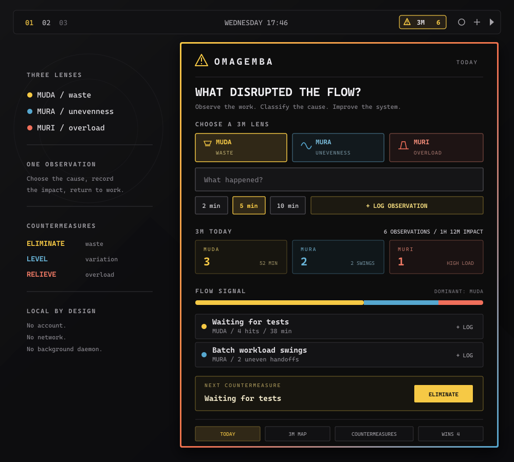

# OmaGemba

OmaGemba is a local Toyota 3M observation tool for the Omarchy Quattro bar.
Capture friction where work happens, distinguish its cause, and target one
countermeasure at a time.



## The 3M lenses

- `Muda` identifies waste: waiting, excess movement, rework, and unnecessary steps.
- `Mura` identifies unevenness: unstable demand, timing, workload, and handoffs.
- `Muri` identifies overload: excessive pressure, parallel work, or unsafe effort.

## Features

- One-action observations classified as Muda, Mura, or Muri
- Fixed 2, 5, and 10-minute impact estimates
- Quick logging for recurring issues
- Today and rolling seven-calendar-day aggregates
- A ranked 3M Map and dominant flow signal
- Exactly one active countermeasure
- Type-specific actions: Eliminate, Level, and Relieve
- Resolve countermeasures into a local Wins inventory
- Resolved issues leave Today and the 3M Map, then return after a new observation
- One-action recurrence logging from Wins
- Theme-aware horizontal and vertical Omarchy bar layouts
- No accounts, analytics, network requests, or separate daemon

## Requirements

- Omarchy 4 with shell plugin support

## Usage

1. Click the `3M` bar widget.
2. Choose Muda, Mura, or Muri, describe the disruption, and estimate its impact.
3. Use `Target` to start one countermeasure for a recurring issue.
4. Record the result as a Win. The resolved issue leaves Today and the 3M Map.
5. If the issue returns, use `Log recurrence` from its latest Win.

## Data

All data stays in:

```text
~/.local/state/omarchy/omagemba.json
```

OmaGemba retains up to 500 observations and 100 wins. It runs with your user
permissions and does not modify shell configuration directly.

State is written through Quickshell's `FileView` with `atomicWrites`, so a
failed or interrupted save never leaves a partially written file. Before every
read and every write the plugin verifies, with a single fixed-path `find`
invocation run without a shell and with a cleared environment, that the state
path is a regular file within a 1 MiB bound. If the path is a symlink, a
directory, a device, or an oversized file, OmaGemba refuses to read or write it
and reports the condition in its panel rather than following the path.

## Development validation

```sh
node tests/model.test.js
omarchy plugin validate .
qmllint -I "$OMARCHY_PATH/shell" Service.qml BarWidget.qml Panel.qml
```

If `qmllint` is unavailable, Qt's bytecode compiler can perform the syntax
check:

```sh
/usr/lib/qt6/qmlcachegen --only-bytecode --warnings-are-errors \
  -I "$OMARCHY_PATH/shell" -o /tmp/omagemba-service.qmlc Service.qml
/usr/lib/qt6/qmlcachegen --only-bytecode --warnings-are-errors \
  -I "$OMARCHY_PATH/shell" -o /tmp/omagemba-bar-widget.qmlc BarWidget.qml
/usr/lib/qt6/qmlcachegen --only-bytecode --warnings-are-errors \
  -I "$OMARCHY_PATH/shell" -o /tmp/omagemba-panel.qmlc Panel.qml
```

## Installation

```sh
omarchy plugin add https://github.com/zamak/omagemba.git --enable
```

The permanent plugin ID is `tiho.omagemba`.

## Removal

```sh
omarchy plugin remove tiho.omagemba
```

Removing the plugin leaves its local state intact. To remove that data too,
delete `~/.local/state/omarchy/omagemba.json` after uninstalling.

## License

[MIT](LICENSE)
